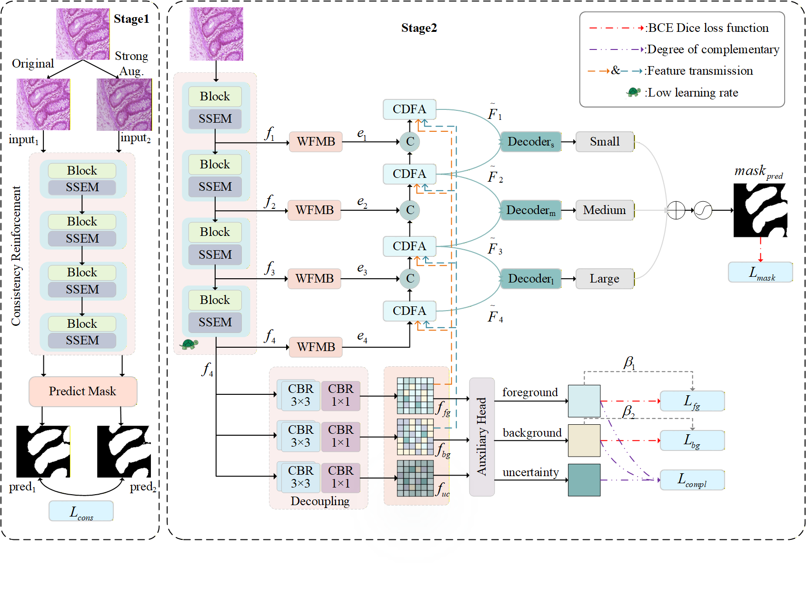
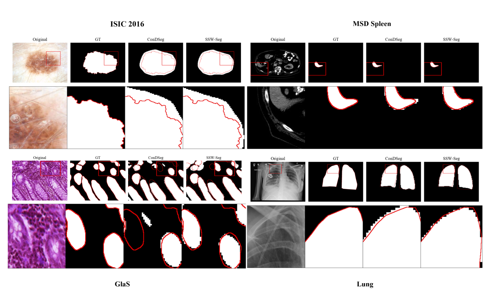

# SSW-Seg: State-Space Structural Enhancement and Wavelet Multi-Scale Fusion for Medical Image Segmentation

This repository provides the PyTorch implementation of **SSW-Seg: State-Space Structural Enhancement and Wavelet Multi-Scale Fusion for Medical Image Segmentation**.

SSW-Seg is designed for binary medical image segmentation. It enhances a contrast-driven segmentation framework with two complementary feature enhancement modules:

- **Selective Spatial Enhancement Module (SSEM)**: introduces visual state-space modeling into the encoder through 2D selective scanning, which strengthens long-range spatial dependency modeling and global structural consistency.
- **Wavelet Multi-Scale Fusion Module (WMFM)**: uses multi-branch wavelet convolution to extract spatial details and frequency-domain boundary textures under different receptive fields.

The model was evaluated on four public medical image segmentation datasets: GlaS, ISIC 2016, Lung, and MSD Spleen.

## News

- The current repository contains the training, testing, ablation, and local zoom-in visualization scripts used in our experiments.
- The implementation is built on the contrast-driven segmentation codebase and adds SSEM and WMFM for enhanced encoded feature representation.

## Framework

The overall framework of SSW-Seg is shown below.



## Main Files

```text
ConDSeg-main/
+-- network/
|   +-- model.py             # Contrast-driven base segmentation framework
|   +-- model12.py           # Full SSW-Seg model with SSEM and WMFM
|   +-- model_stage1.py      # Stage-1 encoder pretraining network
|   +-- model_stage2.py      # Stage-2 SSEM ablation network
|   +-- VSS.py               # SS2D/VSSAdapter implementation for SSEM
|   +-- wtconv.py            # Wavelet convolution implementation for WMFM
|   +-- resnet.py            # ResNet50 backbone
+-- utils/
|   +-- run_engine.py        # Training and evaluation loops for the full framework
|   +-- run_engine_stage1.py # Stage-1 training and evaluation loops
|   +-- metrics.py           # Loss functions and metrics
|   +-- wavelet.py           # Wavelet transform utilities
|   +-- utils.py             # Common utility functions
+-- tools/
|   +-- make_zoom_visuals.py # Local zoom-in visualization script
+-- train_stage1*.py         # Stage-1 training scripts
+-- train*.py                # Stage-2/full-model and ablation training scripts
+-- test*.py                 # Testing scripts
+-- README.md
```

The full SSW-Seg model used for the final experiments is implemented as `ConDSeg12` in `network/model12.py`. The file `network/model.py` keeps the contrast-driven base framework and is useful for baseline comparison.

## Requirements

The code was developed with PyTorch and CUDA-enabled GPUs. The experiments in the paper were conducted on an NVIDIA RTX A4000 GPU.

Core dependencies:

```bash
conda create -n sswseg python=3.10
conda activate sswseg

pip install torch torchvision
pip install numpy opencv-python albumentations tqdm scipy scikit-image scikit-learn PyWavelets pillow
pip install timm einops thop fvcore
```

SSEM depends on the selective scan operator used by Mamba-style state-space models. Please install `mamba-ssm` according to your CUDA and PyTorch versions:

```bash
pip install causal-conv1d mamba-ssm
```

If the `mamba-ssm` installation fails, please follow the official installation instructions of Mamba and make sure the CUDA, PyTorch, and compiler versions are compatible.

## Dataset Preparation

The data loader expects each dataset to be organized as follows:

```text
DATA_ROOT/
+-- DATASET_NAME/
    +-- images/
    |   +-- case_001.png
    |   +-- case_002.png
    |   +-- ...
    +-- masks/
    |   +-- case_001.png
    |   +-- case_002.png
    |   +-- ...
    +-- train.txt
    +-- val.txt
```

Each line in `train.txt` and `val.txt` should contain the image name without file extension, for example:

```text
case_001
case_002
case_003
```

The loader supports `.jpg`, `.JPG`, `.png`, and `.PNG` files. The image and mask files must share the same stem name.

Dataset names used in the scripts:

| Dataset in paper | Script folder name |
| --- | --- |
| GlaS | `Glas` or the local folder name used in your split |
| ISIC 2016 | `ISIC` |
| Lung | `lung_unet` |
| MSD Spleen | `spleen` |

Before training or testing, update the following variables in the corresponding script:

```python
dataset_name = "DATASET_NAME"
base_dir = "PATH/TO/DATA_ROOT"
pretrained_backbone = "PATH/TO/STAGE1_OR_STAGE2_CHECKPOINT"
checkpoint_path = "PATH/TO/CHECKPOINT"
```

## Training

SSW-Seg follows a two-stage training strategy.

### Stage 1: encoder pretraining

Stage 1 trains an encoder with a lightweight prediction head. It provides a stable initialization for the subsequent complete segmentation network.

Example commands:

```bash
python train_stage1.py          # GlaS or the dataset configured in the script
python train_stage1_isic.py     # ISIC 2016
python train_stage1_lung.py     # Lung
python train_stage1_spleen.py   # MSD Spleen
```

Training logs and checkpoints are saved under:

```text
run_files/DATASET_NAME/
```

### Stage 2: full SSW-Seg training

The complete SSW-Seg model is implemented in `network/model12.py`. The corresponding scripts instantiate `ConDSeg12`, load the pretrained encoder weights, and train the full network end to end.

Example commands:

```bash
python train_1_2_3.py       # Full SSW-Seg for the configured GlaS-style dataset
python train_isic_2.py      # Full SSW-Seg for ISIC 2016
python train_lung_2.py      # Full SSW-Seg for Lung
python train_spleen_2.py    # Full SSW-Seg for MSD Spleen
```

The repository also keeps baseline and ablation scripts. In particular:

- `train.py`, `train_isic.py`, `train_lung.py`, and `train_spleen.py` train the contrast-driven base framework.
- `train_stage2*.py` trains the SSEM-based stage-2 ablation network.
- Other `train*.py` files correspond to module ablations used during development.

## Testing

Set `dataset_name`, `size`, `checkpoint_path`, and the model class in the test script before running evaluation.

For the full SSW-Seg model, use `ConDSeg12`:

```python
from network.model12 import ConDSeg12
model = ConDSeg12(H, W)
```

Example:

```bash
python test2.py
```

The predicted masks and metric file are saved under:

```text
results/DATASET_NAME/MyModel/
+-- mask/
+-- result.txt
```

The evaluation reports Jaccard, F1, Recall, Precision, Accuracy, F2, IoU, and Dice.

## Local Zoom-in Visualization

To better inspect boundary details and difficult local regions, this repository provides a local zoom-in visualization script:

```bash
python tools/make_zoom_visuals.py --preset glas
python tools/make_zoom_visuals.py --preset isic
python tools/make_zoom_visuals.py --preset lung
python tools/make_zoom_visuals.py --preset spleen
```

The generated panels are saved under:

```text
results/zoom_visuals/
```

You can also specify a custom case and region of interest:

```bash
python tools/make_zoom_visuals.py \
  --dataset-root Glas \
  --result-root ConDSeg-main/results/Glas/MyModel \
  --methods ConDSeg=mask_82.05 SSW-Seg=mask_new_1_2 \
  --case testA_10:100,80,280,260
```



## Expected Results

The following results are reported in the manuscript. All values are percentages.

| Dataset | IoU | DSC | Recall | Accuracy |
| --- | ---: | ---: | ---: | ---: |
| GlaS | 83.60 | 90.58 | 91.13 | 90.96 |
| ISIC 2016 | 86.65 | 92.42 | 94.38 | 96.72 |
| Lung | 90.76 | 95.13 | 94.89 | 97.23 |
| MSD Spleen | 91.80 | 95.16 | 96.66 | 99.92 |

Small numerical differences may occur because of random initialization, CUDA/cuDNN behavior, and data preprocessing details.

## License

This repository is released for academic research use. For commercial use or redistribution, please contact the authors.

## Contact

For questions about the code or paper, please open an issue in this repository or contact the corresponding author.


